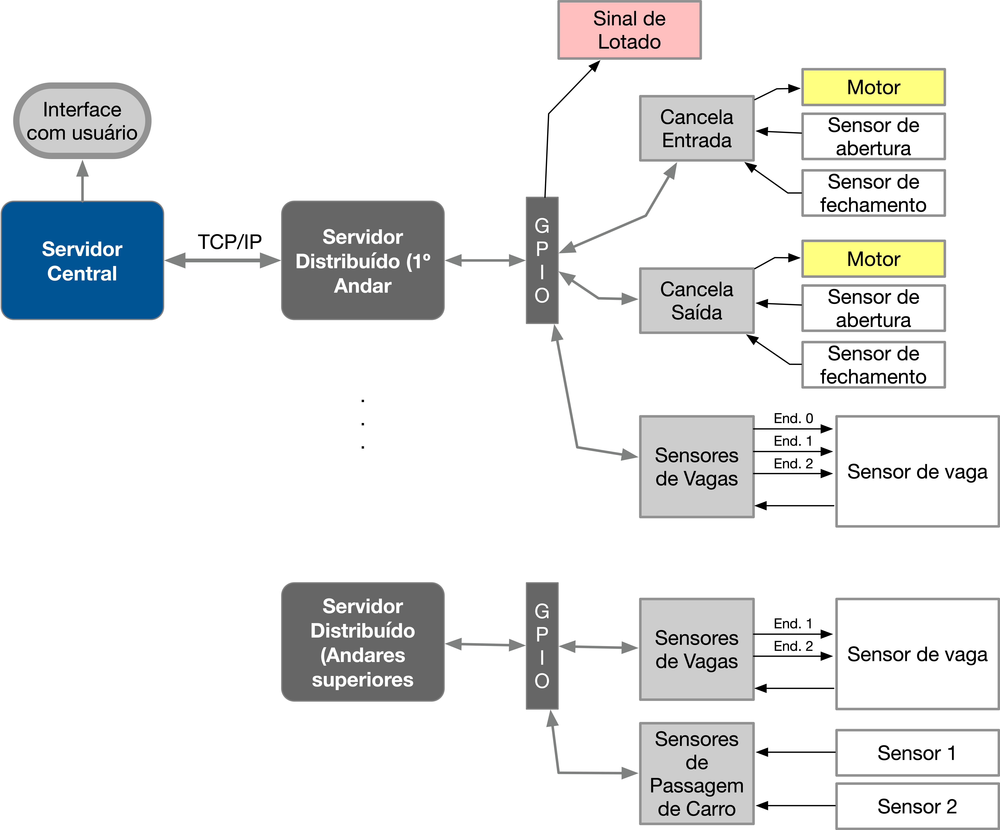

# Trabalho 1 (2023-1) - Controle de Estacionamentos

Trabalho 1 da disciplina de Fundamentos de Sistemas Embarcados (2023/1)

## 1. Objetivos

Este trabalho tem por objetivo a criação de um sistema distribuído para o controle e monitoramento de estacionamentos comerciais. Dentre os itens controlados teremos a entrada e saída de veículos, a ocupação de cada vaga individualmente, a ocupação do estacionamento como um todo e a cobrança por tempo de permanência.

O sistema deve ser desenvolvido para funcionar em um conjunto de placas Raspberry Pi com um ***servidor central*** responsável pelo controle e interface com o usuário e ***servidores distribuídos*** para o controle de todos os sensores e atuadores de cada andar do estacionamento. 

A Figura 1 mostra o layout do estacionamento.

Composição dos sensores e atuadores do sistema:

### 1º Andar:
- **Cancela de entrada**: **botão** para simular a chegada de uma carro, **sensor de prenseça** indicando a presença do carro aguardando a cancela abrir, a **cancela** e um **sensor de passagem** indicando que a cancela pode ser fechada;  
- **Sinal de lotado** (Led vermelho): indicando quando o estacionamento está cheio;  
- **Cancela de saída**: **sensor de prenseça** indicando a presença do carro aguardando a cancela abrir, a **cancela** e um **sensor de passagem** indicando que a cancela pode ser fechada;  
- **8 vagas** com sensores indicando a ocupação da vaga e um botão para remover o carro;  

### 2º Andar:
- **8 vagas** com sensores indicando a ocupação da vaga e um botão para remover o carro;  
- **Sinal de lotado** (Led vermelho): indicando quando o andar está lotado;  
- Dois sensores que indicam a **passagem de veículos** entre os andares.  

Cada andar deve ser controlado por um **processo** individual que esteja rodando em uma placa Raspberry Pi e cada controlador de andar deve se comunicar via rede (TCP/IP) com o servidor central.  

Na Figura 2 é possível ver a arquitetura do sistema.

## 2. Componentes do Sistema e Conexões entre os módulos do sistema

Para simplificar a implementação e logística de testes do trabalho, a quantidade de andares será limitada a 2 sendo que haverão 2 placas Raspberry Pi, cada uma dedicada a rodar os serviços de controle de um dos andares. O Servidor Central poderá ser executado em qualquer uma das placas.

1. Os servidores distribuídos deverão se comunicar com o servidor central através do Protocolo TCP/IP (O formato das mensagens ficam à cargo do aluno. A sugestão é o uso do formato JSON);  
2. Cada instância do servidor distribuído (uma por andar) deve rodar em um processo paralelo em portas distintas) em cada uma das duas placas Raspberry Pi;  
3. Cada entrada / saída está representada na Tabela abaixo. Cada servidor distribuído é responsável pelo controle de um andar.  

<b>Tabela 1</b> - Pinout da GPIO da Raspberry Pi do <b>1º Andar</b> - Placas dos Estacionamentos 1 a 3

 

| Item                                              | GPIO | Direção |
|---------------------------------------------------|:----:|:-------:|
| ENDERECO_01                                       |  22  | Saída   |
| ENDERECO_02                                       |  26  | Saída   |
| ENDERECO_03                                       |  19  | Saída   |
| SENSOR_DE_VAGA                                    |  18  | Entrada |
| SINAL_DE_LOTADO_FECHADO                           |  27  | Saída   |
| SENSOR_ABERTURA_CANCELA_ENTRADA                   |  23  | Entrada |
| SENSOR_FECHAMENTO_CANCELA_ENTRADA                 |  24  | Entrada |
| MOTOR_CANCELA_ENTRADA                             |  10  | Saída   |
| SENSOR_ABERTURA_CANCELA_SAIDA                     |  25  | Entrada |
| SENSOR_FECHAMENTO_CANCELA_SAIDA                   |  12  | Entrada |
| MOTOR_CANCELA_SAIDA                               |  17  | Saída   |

 

<b>Tabela 2</b> - Pinout da GPIO da Raspberry Pi do <b>2º Andar</b> - Placas dos Estacionamentos 1 a 3

 

| Item                                              | GPIO | Direção |
|---------------------------------------------------|:----:|:-------:|
| ENDERECO_01                                       |  13  | Saída   |
| ENDERECO_02                                       |  06  | Saída   |
| ENDERECO_03                                       |  05  | Saída   |
| SENSOR_DE_VAGA                                    |  20  | Entrada |
| SINAL_DE_LOTADO_FECHADO                           |  08  | Saída   |
| SENSOR_DE_PASSAGEM_1                              |  16  | Entrada |
| SENSOR_DE_PASSAGEM_2                              |  21  | Entrada |

 

<b>Tabela 3</b> - Pinout da GPIO da Raspberry Pi do <b>1º Andar</b> - Placas dos <b>Estacionamentos 4</b>

 

| Item                                              | GPIO | Direção |
|---------------------------------------------------|:----:|:-------:|
| ENDERECO_01                                       |  26  | Saída   |
| ENDERECO_02                                       |  19  | Saída   |
| ENDERECO_03                                       |  13  | Saída   |
| SENSOR_DE_VAGA                                    |   9  | Entrada |
| SINAL_DE_LOTADO_FECHADO                           |   6  | Saída   |
| SENSOR_ABERTURA_CANCELA_ENTRADA                   |  10  | Entrada |
| SENSOR_FECHAMENTO_CANCELA_ENTRADA                 |  22  | Entrada |
| MOTOR_CANCELA_ENTRADA                             |   5  | Saída   |
| SENSOR_ABERTURA_CANCELA_SAIDA                     |  27  | Entrada |
| SENSOR_FECHAMENTO_CANCELA_SAIDA                   |  17  | Entrada |
| MOTOR_CANCELA_SAIDA                               |   0  | Saída   |

 

<b>Tabela 4</b> - Pinout da GPIO da Raspberry Pi do <b>2º Andar</b> - Placas dos <b>Estacionamentos 4</b>

 

| Item                                              | GPIO | Direção |
|---------------------------------------------------|:----:|:-------:|
| ENDERECO_01                                       |  21  | Saída   |
| ENDERECO_02                                       |  20  | Saída   |
| ENDERECO_03                                       |  16  | Saída   |
| SENSOR_DE_VAGA                                    |  12  | Entrada |
| SINAL_DE_LOTADO_FECHADO                           |  23  | Saída   |
| SENSOR_DE_PASSAGEM_1                              |  25  | Entrada |
| SENSOR_DE_PASSAGEM_2                              |  24  | Entrada |

 

[Link do Dashboard - Estacionamento 1](http://164.41.98.25:443/dashboard/55d19de0-d5ae-11ed-abfa-f3ea15799da1?publicId=ba042a80-0322-11ed-9f25-414fbaf2b065)  

[Link do Dashboard - Estacionamento 2](http://164.41.98.25:443/dashboard/7ec34170-e49c-11ed-97a9-572f7863d28a?publicId=ba042a80-0322-11ed-9f25-414fbaf2b065)  

[Link do Dashboard - Estacionamento 3](http://164.41.98.25:443/dashboard/847b0ee0-e848-11ed-b4be-6f8edbfbbea8?publicId=ba042a80-0322-11ed-9f25-414fbaf2b065)  

[Link do Dashboard - Estacionamento 4](http://164.41.98.25:443/dashboard/8eaec5e0-e772-11ed-b4be-6f8edbfbbea8?publicId=ba042a80-0322-11ed-9f25-414fbaf2b065)  

## 3. Funcionamento e Requisitos

O controle do estacionamento deverá funcionar da seguine maneira:

1. A entrada de um novo carro é acionada através do botão **Entrada**. Ao ser pressionado um carro chega à Cancela de Entrada e aciona o **Sensor de Abertura da Cancela de Entrada**;  
2. Ao detectar um novo carro na **Cancela de Entrada**, o sistema deverá registrar a entrada do carro (Data/hora), gerar um **Identificador** e em seguida acionar o **Motor da Cancela de Entrada**;  
3. Ao abrir a cancela, o carro irá automaticamente entrar a acionar o **Sensor de Fechamento da Cancela de Entrada**. Neste momento o sistema deve detectar este evento e **fechar a cancela de entrada**;  
4. O carro irá prosseguir selecionando uma vaga disponível automaticamente (em qualquer um dos andares). Ao estacionar, o sensor de vaga será acionado e deve ser lido para registrar em que posição o carro estacionou, associado o Identificador à esta posição;  
5. É necessário que o sistema faça a leitura periódica de todos os sensores de vaga, para isto, é necessário efetuar uma varredura em cada endereço (0 a 7) acionando as saídas da GPIO correspondentes e, para cada endereço, lendo o sinal do **Sensor de Vaga**;  
6. Caso o carro escolha o 2º Andar, os sensores de passagem serão acionados com um sinal "quadrado" ou um "pulso" de aprox. 100 a 300 ms de largura (Isso significa que cada sensor de passagem irá do valor 0 para 1 e ficará em 1 durante esse período, em seguida retornando para 0). O acionamento dos sensores de passagem ocorrerá na seguinte sequência:    
   1. Sensor de Passagem 1 seguido do 2: indica um carro que **sobe** do 1º para o 2º andar;  
   2. Sensor de Passagem 2 seguido do 1: indica um carro que **desce** do 2º para o 1º andar;  
7. Ao clicar no botão de uma vaga ocupada, o respectivo carro irá se direcionar à **Cancela de Saída** ativando o **Sensor de Abertura da Cancela de Saída**. Caso o carro esteja no 2º Andar, irá acionar primeiro os sensores de passagem para depois ir à cancela;  
8. Ao detectar um novo carro na **Cancela de Saída**, o sistema deverá registrar a saída do carro (Data/hora) e **contabilizar o valor total pago**, e em seguida acionar o **Motor da Cancela de Saída**;  
9. Ao abrir a cancela, o carro irá automaticamente sair a acionar o **Sensor de Fechamento da Cancela de Saída**. Neste momento o sistema deve detectar este evento e **fechar a cancela de saída**;  
10. Por fim, deverá haver um controle do número de veículos em cada andar e no estacionamento como um todo.  
    1. Em caso de **Estacionamento Lotado**, a luz indicadora de Lotação deverá ser acionada.  
    2. Em caso de **lotação do 2º Andar**, a luz indicadora de Lotação deverá ser acionada.  

Os sistema de controle possui os seguintes requisitos:

### **3.1 Servidores Distribuídos**

O código do Servidor Distribuído deve ser desenvolvido em **Python**, **C** ou **C++**;   

Os servidores distribuídos tem as seguintes responsabilidades:  
1. Leitura periódica da ocupação de vagas enviando as mudanças de estado ao servidor central;  
2. **1º Andar**: Controle da cancela: abrir e fechar a cancela de acordo com a presença de um carro na espera.  
   1. **Cancela de entrada**: ao registar a passagem do carro, enviar mensagem ao **Servidor Cental** para o registro da data/hora da entrada;  
   2. **Cancela de saída**: ao registar a passagem do carro, enviar mensagem ao **Servidor Cental** para o registro da data/hora da saída para a contabilização da cobraça;
3. Acionar o sinal de Lotado/Fechado de acordo com um comando vindo do **Servidor Central**;  
4. **2º Andar** detectar a passagem de carros pelos **sensores de passagem** informando o **Servidor Central** de subida ou descida de carros de um andar para o outro;  

### **3.2 Servidor Central**

O código do Servidor Central pode ser desenvolvido em **Python**, **C** ou **C++**. Em qualquer uma das linguagens devem haver instruções explicitas de como instalar e rodar. Para C/C++ basta o Makefile e incluir todas as dependências no próprio projeto.  

O servidor central tem as seguintes responsabilidades:  
1. Manter conexão com os servidores distribuídos (TCP/IP);  
2. Prover uma **interface** que mantenham atualizadas as seguintes informações:  
    a. **Número de carros em cada andar** (Não necessariamente nas vagas, um carro pode estar a caminho da vaga);    
    b. **Número total de carros no estacionamento**;  
    c. **Número de Vagas disponíveis em cada andar**;  
    d. **Valor total pago**: O valor a ser pago deverá ser proporcional aos minutos estacionados. A **taxa por minuto** deve ser **R$ 0,15** (quize centavos por minuto);  
3. Prover **mecanismo na interface** para:  
    a. **Fechar o estacionamento**:   
        1. **Manualmente**: à partir de um comando de usuário **ativar/desativar** o sinal de **Lotado/Fechado**;  
        2. **Automaticamente**: à partir da contagem e lotação total das vagas de todos os andares, **ativar/destivar** o sinal de **Lotado/Fechado**;  
    b. **Bloquear o 2º Andar**:    
        1. mesmo sem estar com todas as vagas ocupadas, sinalizar o impedimento ao 2º Andar ativando o "Sinal de Lotado";     
    

### **3.3 Geral**

1. Os códigos em C/C++ devem possuir Makefile para compilação;  
2. Cada serviço (programa) deve poder ser iniciado independente dos demais e ficar aguardando o acionamento dos demais, re-estabelecento sua conexão TCP/IP assim que os serviços voltem ao ar em qualquer ordem;  
3. Deverá haver um arquivo README no repositório descrevento o modo de instalação/execução e o modo de uso do programa.  

### 3.4. Observações sobre a implementação

1. **Sensor de Passagem**: conforme descrito no item 3, há dois sensores de passagem que funcionam em conjunto para sinalizar a passagem de veículos de um andar para o outro. Os sensores emitem um "pulso" ou "sinal quadrado" no formato \_|‾‾‾|_. Este sinal deve ser detectado a partir da borda de subida e descida e a largura do pulso tem duração entre 100 a 300 ms dependendo da velocidade com que o carro passa pelo sensor. A ordem de acionamento dos sensores indica a direção em que o carro passa da seguinte maneira:  
   1. Sensor de Passagem 1 seguido do 2: indica um carro que **sobe** do 1º para o 2º andar;  
   2. Sensor de Passagem 2 seguido do 1: indica um carro que **desce** do 2º para o 1º andar;  

## 4. Entrega e Critérios de Avaliação

### Entrega:

1. Repositório (no Github Classroom) incluindo o README com as instruções de execução (Para projetos em C/C++ é necessário incluir o Makefile);  
2. Vídeo de aprox. 5 min mostrando o sistema em funcionamento (Mostrando o funcionamento em si e destacar partes do código fonte mais importantes).  

A avaliação será realizada seguindo os seguintes critérios: 

Tabela 5 - Tabela de Avaliação

|   ITEM    |   DETALHE  |   VALOR   |
|-----------|------------|:---------:|
|**Servidor Central**    |       |       |
|**Interface (Monitoramento)**  |  Interface gráfica (via terminal, web, etc) apresentando os dados descritos no item 3.2.  |   1,0   |
|**Interface (Comandos)** | Mecanismo de acionar manualmente os modos descritos no item 3.2. |   1,0   |
|**Monitoramento das Vagas**    |  Contabilização correta de vagas individualmente e por andar, e sinalização de lotação (Geral e por andar).  |   1,0   |
|**Contabilização de Pagamentos**    |  Correta cobrança de ocupação do estacionamento por minuto.  |   1,0   |
|**Servidores Distribuídos**    |       |       |
|**Monitoramento das Vagas**    |  Detecção de ocupação de vagas indivisualmente.  |   1,0   |
|**Controle das Cancelas**    |  Detecção de presença de carros, aguardando, abertura e fechamento correto das cancelas.  |   1,0   |
|**Sensor de Passagem de Carros** |  Detecção da passagem de carros entre os andares indentificando a direção. |   1,0  |
|**Geral**    |       |       |
|**Comunicação TCP/IP**  |   Correta implementação de comunicação entre os servidores usando o protocolo TCP/IP. Re-estabelecimento de conexão caso qualquer dos serviços caia. |   1,0   |
|**Persistência dos serviços**  |  Conexão automática entre os serviços (independente da ordem de inicialização) e re-estabelecimento de conexão caso qualquer dos serviços caia. |   1,0   |
|**Qualidade do Código / Execução** |   Utilização de boas práticas como o uso de bons nomes, modularização e organização em geral, bom desempenho da aplicação sem muito uso da CPU. |  1,5 |
|**Pontuação Extra** |   Qualidade e usabilidade acima da média. |   0,5   |  

## 5. Referências

### Bibliotecas em Python

- gpiozero (https://gpiozero.readthedocs.io)
- RPi.GPIO (https://pypi.org/project/RPi.GPIO/)

A documentação da RPi.GPIO se encontra em
https://sourceforge.net/p/raspberry-gpio-python/wiki/Examples/

### Bibliotecas em C/C++

- WiringPi (http://wiringpi.com/)
- BCM2835 (http://www.airspayce.com/mikem/bcm2835/)
- PiGPIO (http://abyz.me.uk/rpi/pigpio/index.html)
- sysfs (https://elinux.org/RPi_GPIO_Code_Samples)

### Lista de Exemplos

Há um compilado de exemplos de acesso à GPIO em várias linguages de programação como C, C#, Ruby, Perl, Python, Java e Shell (https://elinux.org/RPi_GPIO_Code_Samples).
