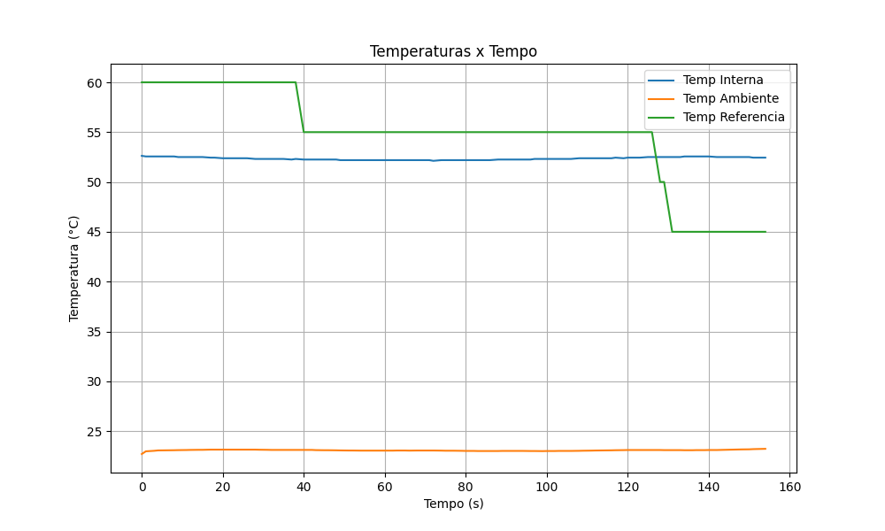
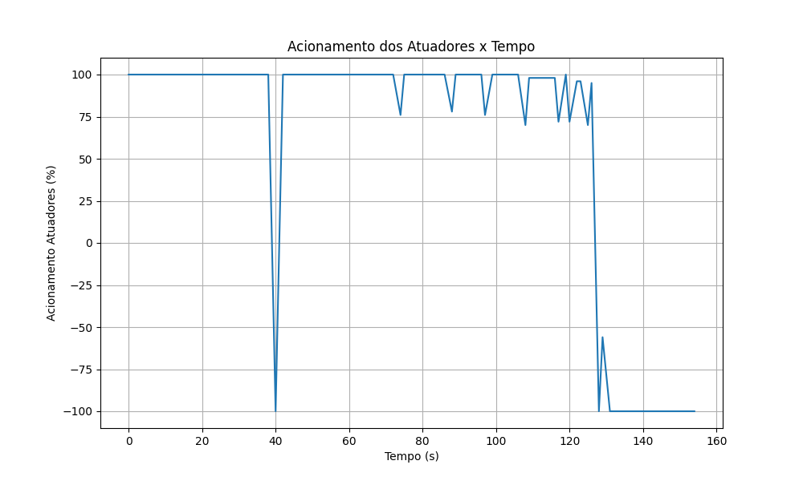
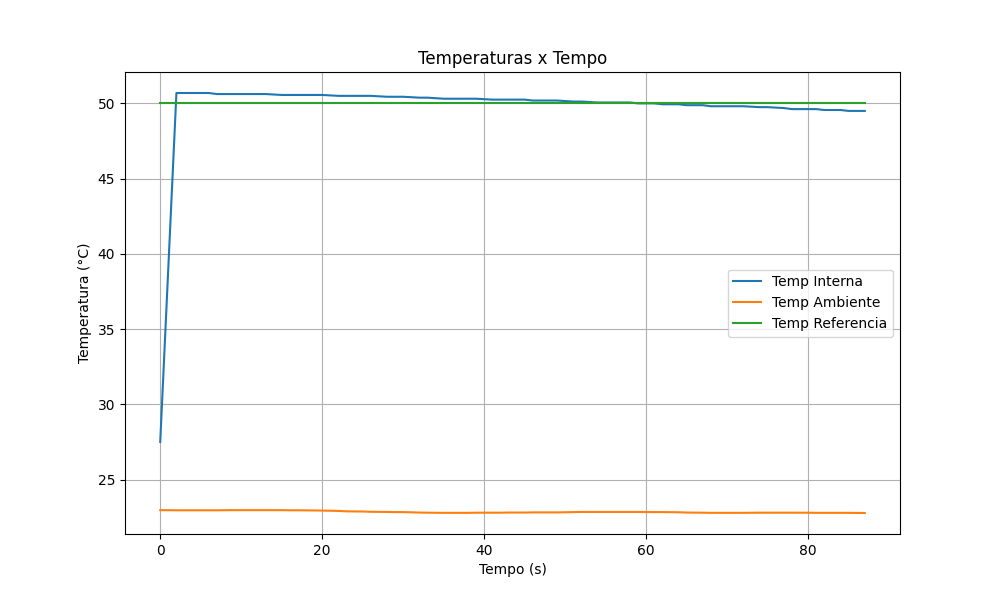
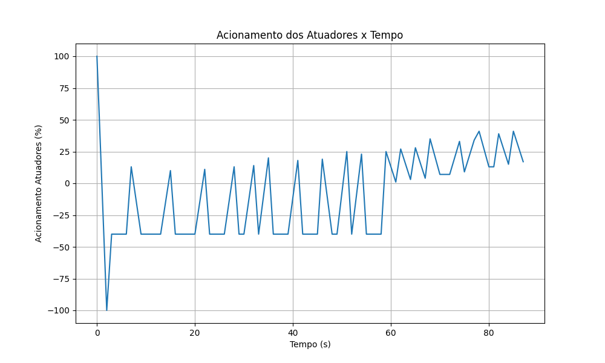
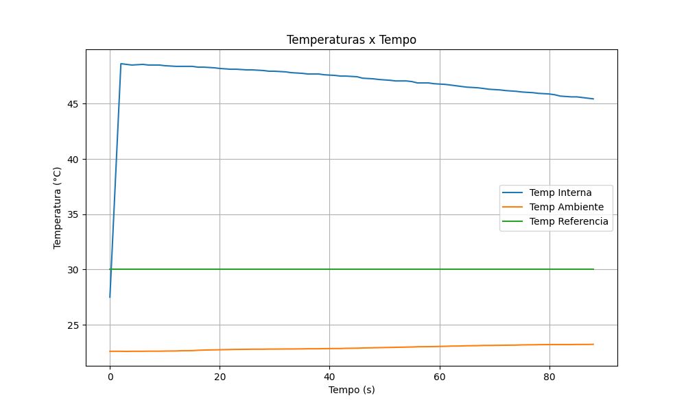
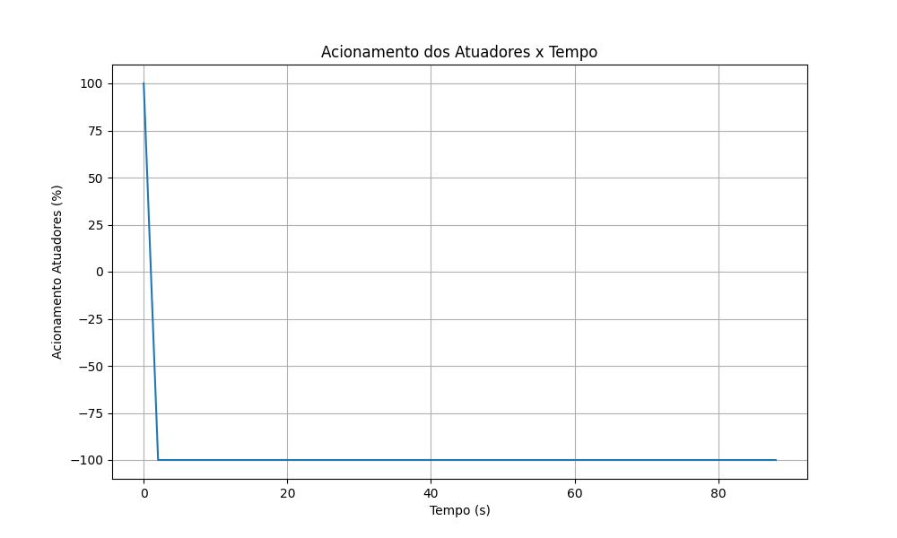

# Trabalho 2 (2023-1) - Controle da AirFryer

**Aluno**: Victor Hugo Oliveira Leão

**Matrícula**: 200028367

[Enunciado do trabalho](https://github.com/FGA-FSE/fse-trabalho-2-2023-1-controle-da-airfryer-victorleaoo/tree/main/enunciado)

## Instruções de execução

### Variáveis

Mude os seguintes arquivos com as informações desejadas:

- [gpio/utils/componentes](https://github.com/FGA-FSE/fse-trabalho-2-2023-1-controle-da-airfryer-victorleaoo/blob/main/src/gpio/utils/componentes.py):
    * ENCODER_CLK: Pino de clock do Encoder
    * ENCODER_DT: Pino de DT do Encoder
    * ENCODER_SW: Pino de SW do Encoder
    * RESISTOR: Pino do resistor
    * VENTOINHA: Pino da Ventoinha
    * FREQUENCIA: Frequência para o resistor e ventoinha

- [i2c/utils/config](https://github.com/FGA-FSE/fse-trabalho-2-2023-1-controle-da-airfryer-victorleaoo/blob/main/src/i2c/utils/config.py):
    * END_BMP280: Endereço do barramento do sensor BMP280
    * END_LCD: Endereço do barramento do LCD

- [PID/pid_use](https://github.com/FGA-FSE/fse-trabalho-2-2023-1-controle-da-airfryer-victorleaoo/blob/main/src/PID/pid_use.py):
    * Como parâmetros do construtor (init), é possível alterar o **kip**, **ki** e **kd** do PID.

- [uart/utils/config](https://github.com/FGA-FSE/fse-trabalho-2-2023-1-controle-da-airfryer-victorleaoo/blob/main/src/uart/utils/config.py):
    * PORT_UART: a porta da UART.
    * BAUDRATE: baudrate da UART.
    * Os comandos/códigos utilizados: alterar onde tem a sequência 8, 3, 6, 7 para a sua matrícula.

- [menu](https://github.com/FGA-FSE/fse-trabalho-2-2023-1-controle-da-airfryer-victorleaoo/blob/main/src/menu.py):
    * opcoes_automatico: mudar as opções de automático pré-determinados.

### Execução

Instale as dependências: ```pip install -r requirements.txt```

Execute o seguinte comando na pasta raiz depois do git clone ```python3 ./src/main.py```

### Funcionamento

#### Modo Dashboard (Manual)

 * O dashboard será setado para configurações padrões iniciais.
 * Selecione tempo e temperatura desejados.
 * Clique em 'ligar' e 'iniciar'.
 * O funcionamento iniciará. Quando a temperatura estiver em um range de -2 a 2, o tempo começará a ser reduzido em segundos.
 * Caso o usuário interrompa com CTRL+C ou o tempo acabe, a AirFryer será desligada e voltará para configurações padrões iniciais.

#### Modo Encoder / Terminal Manual

 * O usuário informa sua temperatura e tempo desejados.
 * A AirFryer e 0 funcionamento iniciará. Quando a temperatura estiver em um range de -2 a 2, o tempo começará a ser reduzido em segundos.
 * Caso o usuário interrompa com CTRL+C ou o tempo acabe, a AirFryer será desligada e voltará para configurações padrões iniciais.

#### Modo Encoder / Terminal Automático

 * O usuário seleciona uma das opções pré-definidas.
 * O sistema ativará o botão de modo automático.
 * O funcionamento iniciará. Quando a temperatura estiver em um range de -2 a 2, o tempo começará a ser reduzido em segundos.
 * Caso o usuário interrompa com CTRL+C ou o tempo acabe, a AirFryer será desligada e voltará para configurações padrões iniciais.

## Gráficos

### Modo Dashboard

#### Temperaturas



#### Acionamento Atuadores



### Modo Manual

#### Temperaturas



#### Acionamento Atuadores



### Modo Automático

#### Temperaturas



#### Acionamento Atuadores



## Vídeo

[Link do vídeo apresentando o trabalho](https://www.youtube.com/watch?v=ZO8KLSKzQRE)

## Melhorias

- O modo de Dashboard está funcionando apenas com as configurações de tempo e modo iniciais, então, uma melhoria, seria fazer esse modo funcionar podendo alterar o tempo e o modo (manual ou automático) de forma a "interromper" e alterar o funcionamento que está já em acontecimento. A temperatura é possível de mudar na implementação atual.
- O modo manual do encoder/terminal não permite alterar a temperatura e o tempo, logo, o que o usuário definiu no início é o que será executado até o fim caso ele não interrompa com o CTRL+C.
- Teste e aplicação do Encoder (não foi possível, uma vez que não há modo de teste do Encoder nos Dashboards fornecidos).
