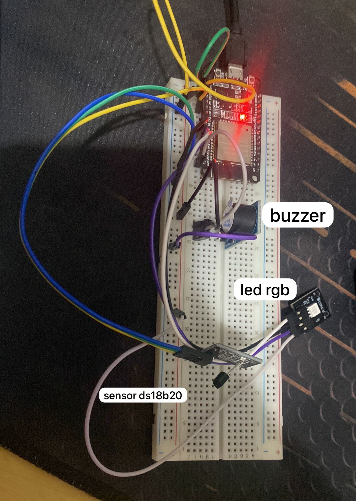

# ESP32 1 - Modo Energia

## Funcionalidades e Sensores

Essa ESP32 é a responsável por funcionar em modo energia e, portanto, tem a funcionalidade de telemetria do sensor. Segua a lista de sensores utilizadas nessa ESP32:

- **Buzzer**: responsável por reproduzir os sons das músicas da boate. Está na GPIO 23.
- **LED RGB**: responsável por reproduzir cores aos sons do buzzer. Estão na GPIO 18 (Red), 19 (Green) e 21 (Blue).
- **Sensor de Temperatura ds18b20**: responsável por ler a temperatura a cada um segundo e a enviar para o dashboard para controle de telemetria. Está na GPIO 4.
- **LED da própria ESP32**: ativada quando o modo de alta temperatura é atingido. Está na GPIO 2.

## Execução

Com a ESP32 ligada ao computador por um cabo USB e ESP-IDF configurada na pasta *~/esp/esp-idf*, siga os seguintes comandos:

1. ```. ~/esp/esp-idf/export.sh``` (tenha certeza que esse é o path para o arquivo export.sh da ESP-IDF).
2. ```idf.py menuconfig```:
    * Configurar Wifi em *Project's Wifi Configuration* (SSID e Senha).
    * Configurar o NVS em *Partition Table* (colocar o arquivo *partition.csv* como padrão).
3. Alterar no arquivo ```main/mqtt.c``` o *URI do broker* e o *username*.
3. ```idf.py build```.
4. ```idf.py -p /dev/ttyUSB0 flash monitor```.

**PRONTO!**. Com isso, é possível monitorar as ações da ESP32 e o projeto já está em andamento.

## Imagem da ESP32 configurada com os sensores



## Fontes

> - Implementar o sensor ds18b20: https://github.com/UncleRus/esp-idf-lib
