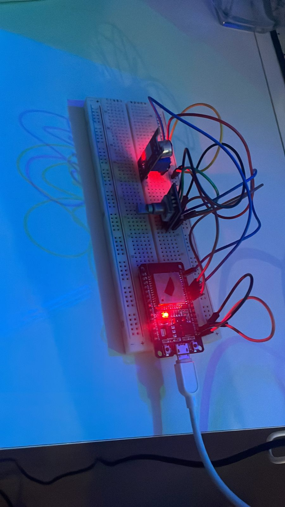

# ESP32 2 - Modo Bateria

## Funcionalidades e Sensores

Essa ESP32 é a responsável por funcionar em modo bateria. Segua a lista de sensores utilizadas nessa ESP32:

- **Encoder digital**: Selecionar a música.
  
- **Sensor de som KY 0-38**: Funciona para a detecção de música ambiente, como parte da retroalimentação do sistema.

## Execução

Com a ESP32 ligada ao computador por um cabo USB e ESP-IDF configurada na pasta *~/esp/esp-idf*, siga os seguintes comandos:

1. ```. ~/esp/esp-idf/export.sh``` (tenha certeza que esse é o path para o arquivo export.sh da ESP-IDF).
2. ```idf.py menuconfig```:
    * Configurar Wifi em *Project's Wifi Configuration* (SSID e Senha).
    * Configurar o NVS em *Partition Table* (colocar o arquivo *partition.csv* como padrão).
3. Alterar no arquivo ```main/mqtt.c``` o *URI do broker* e o *username*.
3. ```idf.py build```.
4. ```idf.py -p /dev/ttyUSB0 flash monitor```.

**PRONTO!**. Com isso, é possível monitorar as ações da ESP32 e o projeto já está em andamento.

## Imagem da ESP32 configurada com os sensores


